# Prueba Técnica - Data Engineer Retail

## Sector seleccionado y justificación

### Sector elegido: Retail

Se seleccionó el sector Retail debido a que presenta múltiples escenarios de negocio y una alta complejidad en el manejo de datos, incluyendo ventas, inventario, clientes, proveedores y devoluciones. Este tipo de industria genera grandes volúmenes de información provenientes de diferentes fuentes y requiere procesos robustos para integración, transformación y análisis.

El escenario Retail permite modelar casos reales de negocio como:

- Análisis de ventas
- Gestión de inventarios
- Segmentación de clientes (RFM)
- Análisis de devoluciones
- KPIs comerciales
- Optimización de abastecimiento

Además, proporciona un caso práctico adecuado para implementar una arquitectura de datos moderna basada en capas.

---

### Plataforma Cloud seleccionada: AWS

Se seleccionó AWS como plataforma cloud debido a su amplio ecosistema de servicios orientados a ingeniería de datos y analítica.
AWS proporciona herramientas administradas que facilitan la construcción de pipelines escalables, seguros y con bajo costo operativo.

Servicios utilizados:

- Amazon S3 para Data Lake (Bronze, Silver y Gold)
- AWS Glue para catálogo y descubrimiento automático de datos
- CloudWatch para monitoreo y logs
- SNS para alertas y notificaciones
- Secrets Manager para gestión segura de credenciales
- IAM para administración de permisos

---

### Justificación de la arquitectura seleccionada

Se implementó una arquitectura Medallion (Bronze, Silver y Gold) porque permite separar los datos por niveles de procesamiento:

**Bronze**

- Almacena datos crudos sin transformaciones.

**Silver**

- Aplica procesos de limpieza, estandarización y validación.

**Gold**

- Contiene modelos analíticos y KPIs listos para consumo.

Esta arquitectura mejora la trazabilidad, facilita el mantenimiento y permite reutilizar los datos para diferentes casos de uso analítico.

---

## Gestión de roles y accesos

Se implementaron roles diferenciados siguiendo el principio de mínimo privilegio:

- RetailDataEngineerRole:
  Lectura/escritura sobre S3, Glue y monitoreo.

- RetailAnalystRole:
  Acceso de solo lectura a datos analíticos.

- RetailAdminRole:
  Control administrativo completo de la plataforma.

Los secretos y credenciales se gestionan mediante AWS Secrets Manager evitando exponer información sensible en el código fuente.

## Objetivo

Construir un pipeline de datos end-to-end usando arquitectura Medallion (Bronze, Silver y Gold) sobre un escenario Retail.

---

## Arquitectura utilizada

PostgreSQL → S3 Bronze → S3 Silver → S3 Gold

### Bronze

Contiene datos crudos sin transformación.

Tablas:

- MSTR_ARTICULOS
- MSTR_PROVEEDORES
- MSTR_TIENDAS
- CRM_MIEMBROS
- TRANS_VENTAS
- INV_STOCK_DIARIO
- POST_DEVOLUCIONES

### Silver

Transformaciones aplicadas:

- Eliminación de duplicados
- Manejo de nulos
- Estandarización de formatos

### Gold

Modelo dimensional generado:

Dimensiones:

- dim_productos
- dim_tiendas
- dim_clientes

Hechos:

- fact_ventas
- fact_inventario
- fact_devoluciones
- fact_rfm_clientes
- kpi_ventas_diarias

---

## Infraestructura

Creada mediante Terraform:

Recursos:

- Bucket Bronze
- Bucket Silver
- Bucket Gold

---

## Tecnologías utilizadas

- Python
- PostgreSQL
- Docker
- Terraform
- AWS S3
- Pandas
- Boto3

---

## Ejecución

### Generar datos

```bash
python generate_data.py
```

### Cargar PostgreSQL

```bash
python load_to_postgres.py
```

### Cargar Bronze

```bash
python upload_to_bronze.py
```

### Procesar Silver

```bash
python silver_transform.py
```

### Procesar Gold

```bash
python gold_transform.py
```

## Arquitectura


Arquitectura implementada:

PostgreSQL → S3 Bronze → S3 Silver → S3 Gold → AWS Glue → CloudWatch + SNS

## Catálogo de datos

Ver catálogo en: [docs/catalogo_datos.md](docs/catalogo_datos.md)

## Evidencias

# Fase 1 — PostgreSQL

### PostgreSQL - tablas creadas

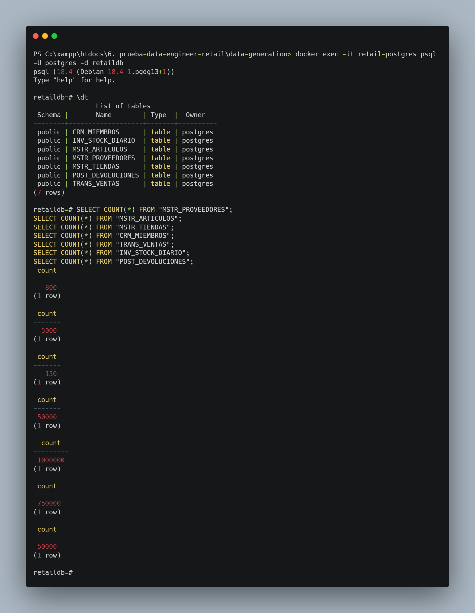

---

# Fase 2 — Infraestructura AWS + Terraform

### Buckets S3 creados

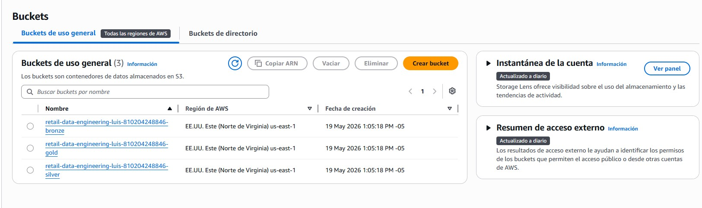

### Terraform Apply

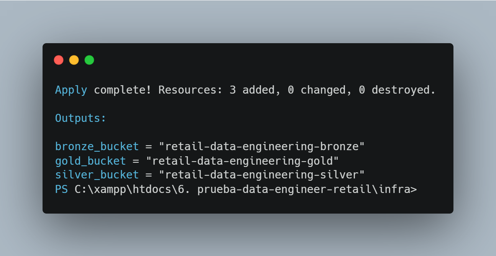

### Buckets creados mediante Terraform

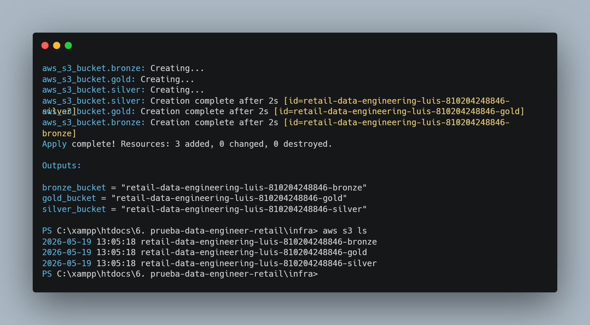

---

# Fase 3 — Pipeline Medallion

### Datos cargados en Bronze

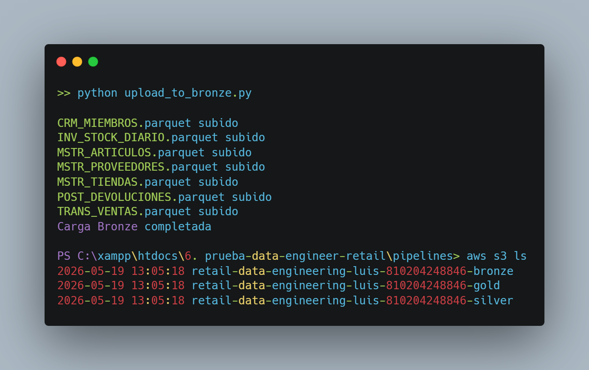

### Flujo Bronze → Silver

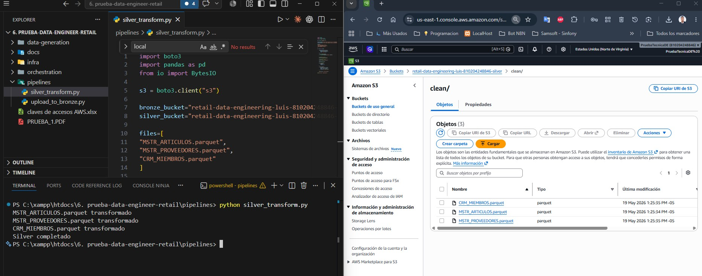

### Calidad inicial de datos

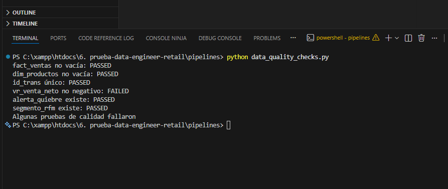

### Gold completo

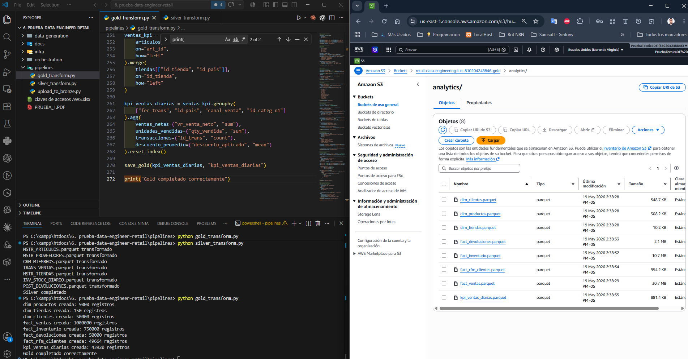

### Dimensión Productos

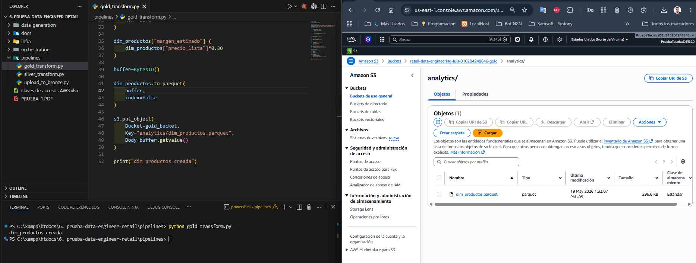

### Dimensión Clientes

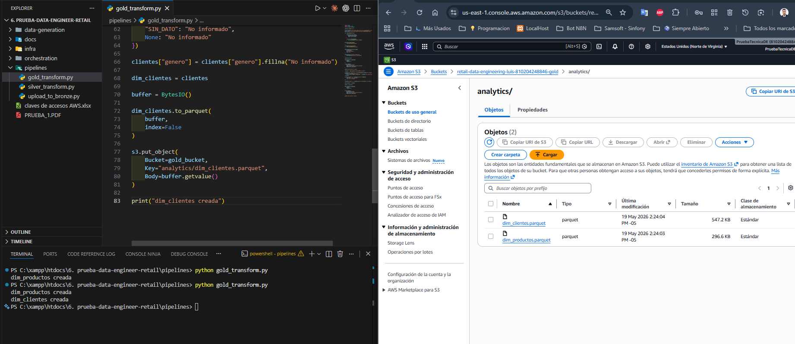

### Fact Ventas

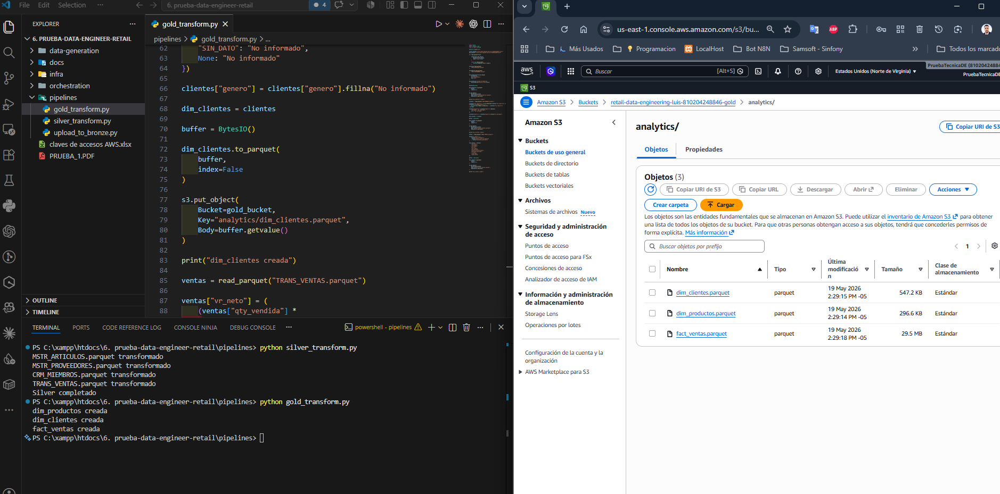

### Segmentación RFM

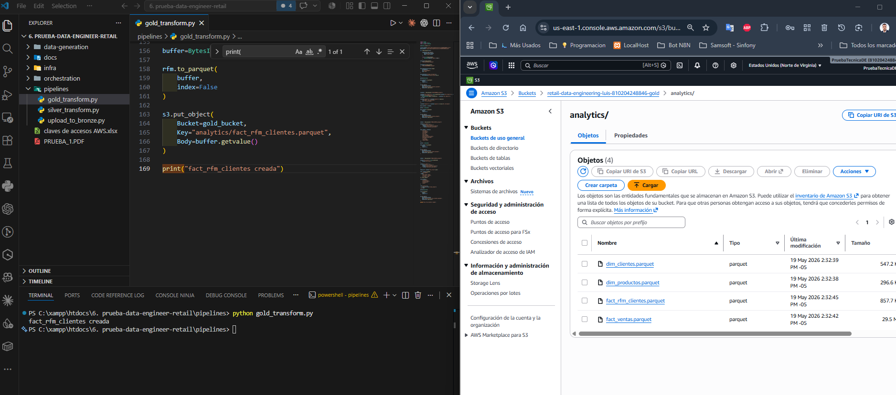

### Pipeline orquestado

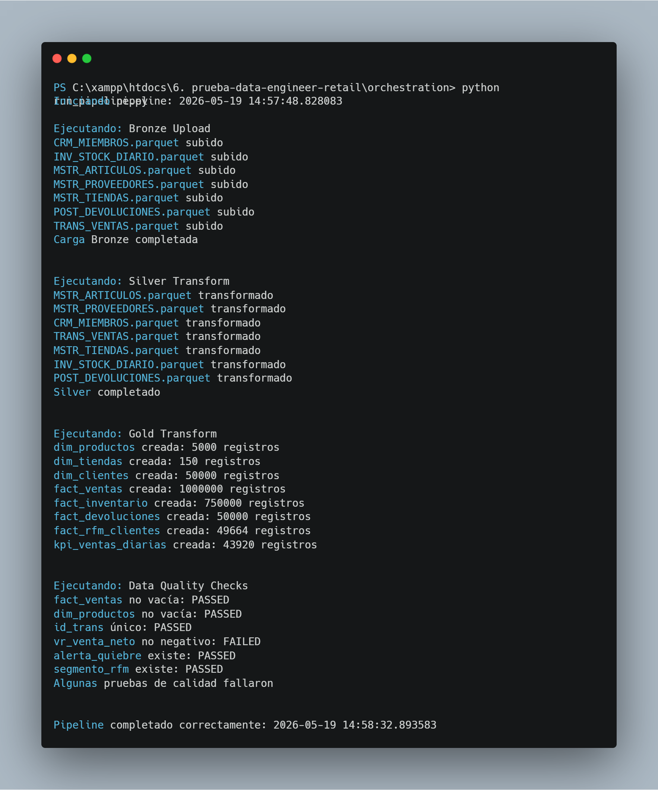

### Buckets Bronze AWS

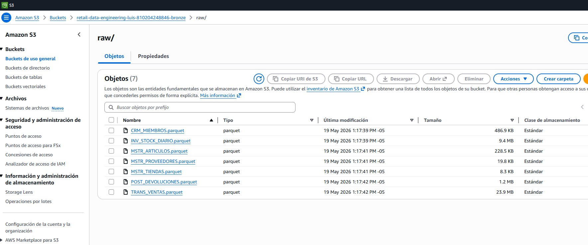

---

# Fase 4 — Seguridad y Gobierno de Datos

### CloudWatch Logs

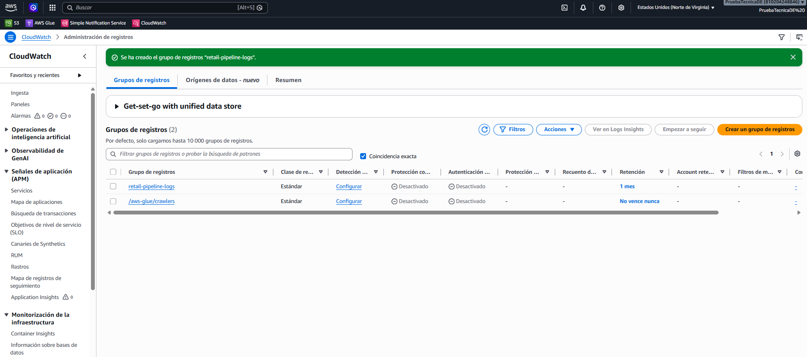

### Data Quality Final

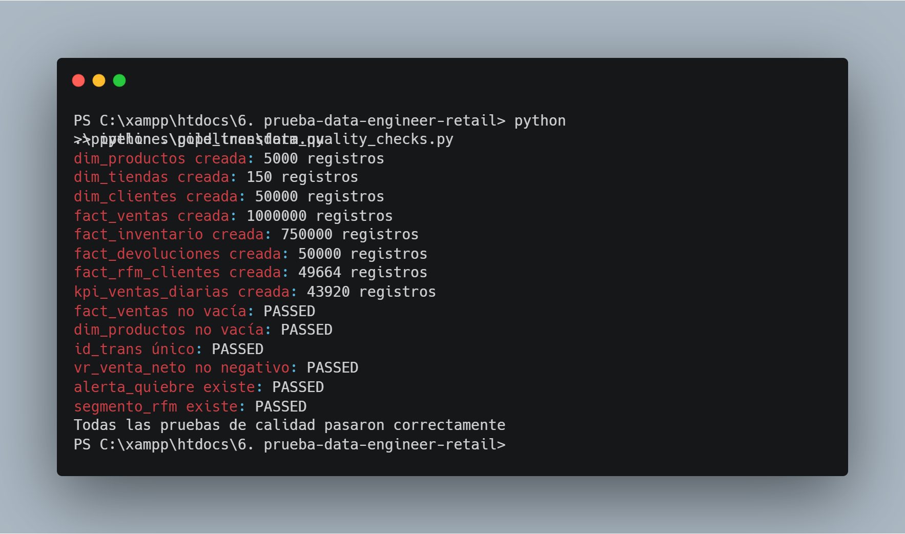

### AWS Glue Data Catalog

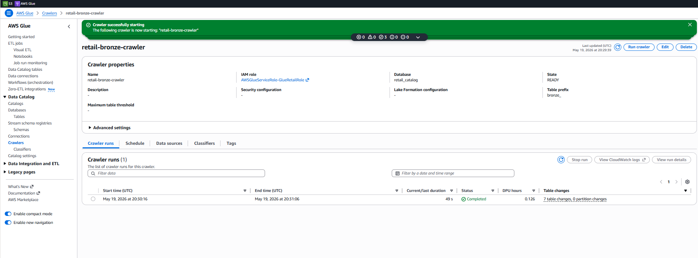

### AWS Secrets Manager

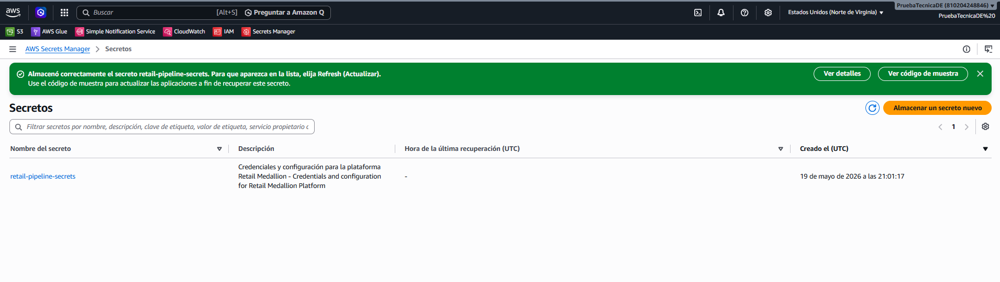

### IAM Roles

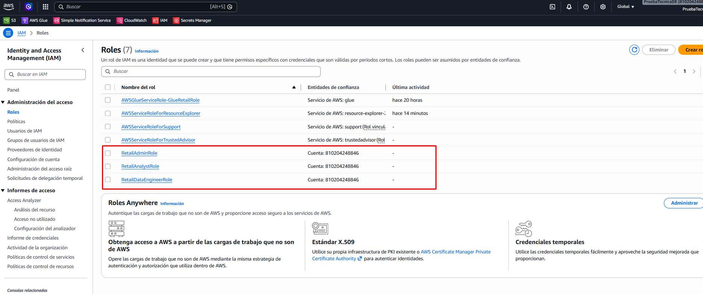

### SNS Alertas

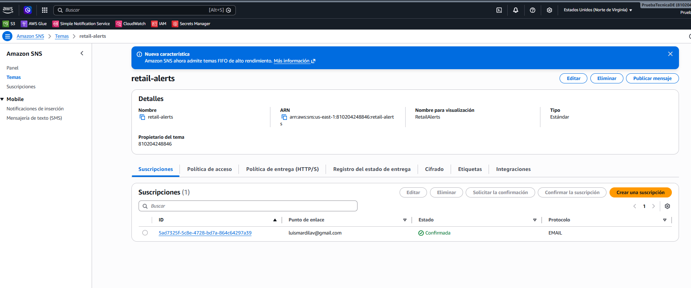

## Arquitectura


---

## Servicios AWS implementados

| Servicio              | Propósito                             |
| --------------------- | ------------------------------------- |
| Amazon S3             | Almacenamiento Bronze, Silver y Gold  |
| AWS Glue Data Catalog | Catálogo automático de tablas         |
| AWS Glue Crawler      | Descubrimiento automático de esquemas |
| CloudWatch Logs       | Centralización de logs                |
| SNS                   | Alertas y notificaciones              |
| Secrets Manager       | Gestión segura de credenciales        |
| IAM                   | Gestión de permisos y roles           |
