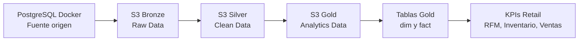

# Diagrama de Arquitectura

```mermaid
flowchart LR

A[PostgreSQL Docker<br>Fuente origen] --> B[S3 Bronze<br>Raw Data]

B --> C[S3 Silver<br>Clean Data]

C --> D[S3 Gold<br>Analytics Data]

D --> E[Tablas Gold<br>dim y fact]

E --> F[KPIs Retail<br>RFM, Inventario, Ventas]
```
